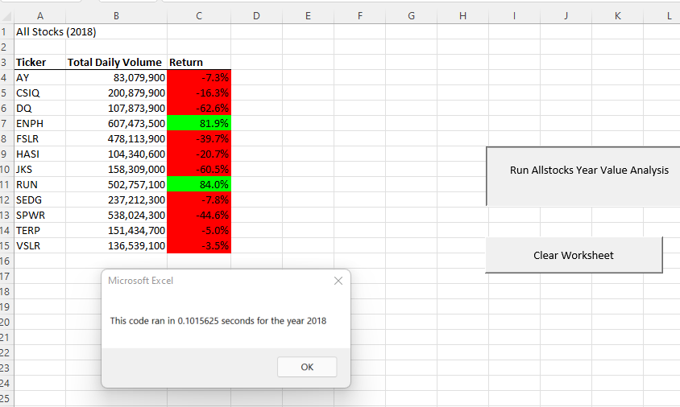
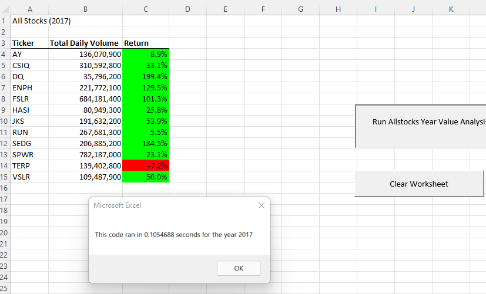
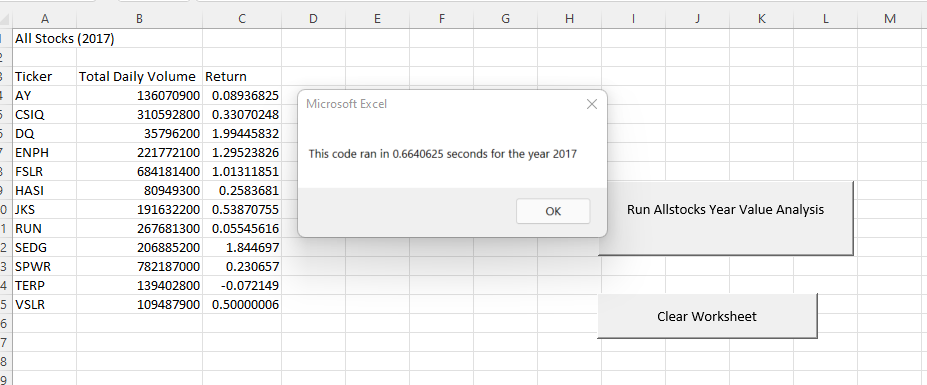
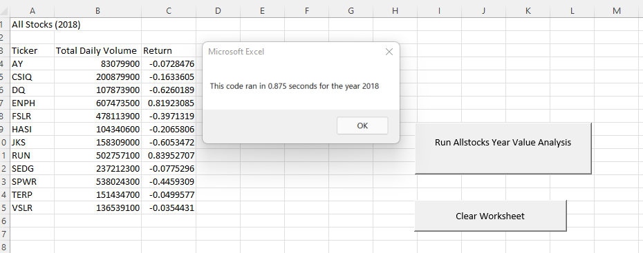

# Stock-Analysis using VBA

## Overview of Project

To determine which stock performed well and which did not by analyze a set of stocks data and output the total daily volume and yearly return for each stock. 

### Purpose

Make the code more efficient by refactoring Module 2 solution code to do fewer steps. Using skills learned: create variable with its data types, logical and comparison operators, use index to access data in an array, for loops, if-then statements, reuse code, formatting, conditional formatting, and measure code performance.  

## Results: 

### Analysis of 2018 stock performance 
The stock performance in 2018 are mostly in negative territory, denoted in Red, except two. 

### Analysis of 2017 stock performance
The stock performance in 2017 are mostly in positive territory, denoted in green, except one

### Execution times of the original script and the refactored script.

In the above photos, the run time of the refactored script were 0.10 seconds for both 2017 and 2018.  In the below photos, the run time using the original script were 0.66 seconds for 2017 and 0.87 seconds for 2018.  As a result, he refactored Script is much more efficient!

## Summary:

- What are the advantages or disadvantages of refactoring code?

  In general, The advantage of refactoring code is time saving; we don't have to start a project all over.  Also, it's run-time is much more efficient, as evident in the challenge project.
  The disadvantage is that it gets very complicated.  For example, when you change or add a new variable to the code it can get very confusing as to where in the code to place the new variable. 

- How do these pros and cons apply to refactoring the original VBA script?

   The advantage of the original VBA script is that it was simple, the thought process was easy to follow. But, the disadvantage of it was that it takes longer to perform a task and time is money to a business.

   The advantage of the refactored script iss that it takes much less time to run a task.  However, the disadvantage is that it is more complicated.  Therefore, it required a person with higher skill level to understand and to code the task.
 
